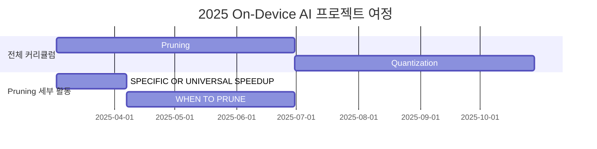

<h1 align="center"> On-Device AI: ON THE AIr </h1>

<div align="center">
<a href="https://pseudo-lab.com"></a>
<a href="https://discord.gg/EPurkHVtp2"></a>
<a href="https://github.com/Pseudo-Lab/On-Device-AI_On-The-AIr/stargazers"></a>
<a href="https://github.com/Pseudo-Lab/On-Device-AI_On-The-AIr/network/members"></a>
<a href="https://github.com/Pseudo-Lab/On-Device-AI_On-The-AIr/pulls"></a>
<a href="https://github.com/Pseudo-Lab/On-Device-AI_On-The-AIr/issues"></a>
<a href="https://github.com/Pseudo-Lab/On-Device-AI_On-The-AIr/graphs/contributors"></a>
<a href="https://hits.seeyoufarm.com"></a>
</div>
<br>

<!-- sheilds: https://shields.io/ -->
<!-- hits badge: https://hits.seeyoufarm.com/ -->
<h1 align="center">  </h1>

> On-Device AI는 현재 "On The Air". AI 기술의 고도화에 따라 모델이 복잡해지고 클라우드 방식의 서비스들이 많이 개발되었습니다. 이에 따른 보안성, 안정성, 비용의 문제를 해결하기 위해 경량화 및 최적화 기술도 많이 연구되고 있습니다. On-Device AI 기술들을 공부하고 이를 응용하여 적은 컴퓨팅 자원에서도 적용될 수 있는 AI 기술을 개발하고자 합니다.

## 🌟 프로젝트 목표 (Project Vision)
_"논문 리뷰를 통해 모델을 경량화하고 최적화하기 위한 방법을 연구하자"_  
- 본 시즌(10기)에서는 Pruning에 대한 다양한 테크닉들을 학습
- 각 테크닉들의 논문을 읽으면서 접근 방식과 특징, 한계를 파악
- 개인 성장과 집단 지혜의 시너지 창출
- 오픈소스 정신을 바탕으로 한 지식 공유 문화


## 🧑 역동적인 팀 소개 (Dynamic Team)

| 역할          | 이름 |  기술 스택 배지                                                                 | 주요 관심 분야                          |
|---------------|------|-----------------------------------------------------------------------|----------------------------------------|
| **Project Manager** | 정현우 |   | On-Device AI, CV, Robotics         |
| **Member** | - | <!--   -->| -                  |


## 🚀 프로젝트 로드맵 (Project Roadmap)



<!-- ## 🛠️ 우리의 개발 문화 (Our Development Culture)
**우리의 개발 문화**  
```python
class CollaborationFramework:
    def __init__(self):
        self.tools = {
            'communication': 'Discord',
            'version_control': 'GitHub Projects',
            'ci/cd': 'GitHub Actions',
            'docs': 'Github Wiki'
        }
    
    def workflow(self):
        return """주간 사이클:
        1️⃣ 월요일: 스프린트 플래닝 (Notion 타임라인 공유)
        2️⃣ 수요일: 코드 리뷰 세션 (Live Share)
        3️⃣ 금요일: 데모데이 (실제 적용 사례 발표)"""
``` -->


<!-- ## 📈 성과 지표 (Achievement Metrics)
**2024 주요 KPI**  
| 지표                     | 목표치 | 현재 달성률 |
|--------------------------|--------|-------------|
| 커밋 수                  | 1,200  | 83%         |
| 이슈 해결률              | 95%    | 89%         | 
| 기술 블로그 게시물       | 24편   | 15편        |
| 오픈소스 기여도          | 8회    | 5회         | -->


## 💻 주차별 활동 (Activity History)

| 날짜 | 내용 | 분류 | 발표자 | 진행방식 | 참고자료 | 비고 |
| -------- | -------- | ---- | --- | --- | --- | --- |
| 2025/03/05 | OT |     |     |     | - |    |
| 2025/03/12 | Unstructured Pruning                 | Unstructured Pruning      | 미정 | 온라인 | [J. Frankle and M. Carbin, “The lottery ticket hypothesis: finding sparse, trainable neural networks,” in ICLR, 2019.](https://arxiv.org/abs/1803.03635) |    |
| 2025/03/19 | Structured Pruning                   | Structured Pruning        | 미정 | 오프라인 | [X. Ma, G. Fang, and X. Wang, “LLM-Pruner: On the structural pruning of large language models,” in NeurIPS, vol. 36, 2023, pp.21 702–21 720.](https://arxiv.org/abs/2305.11627) |    |
| 2025/03/26 | Magical Week 휴일 | - | 미정 | - | - |    |
| 2025/04/02 | Semi-structured Pruning              | Semi-structured Pruning   | 미정 | 온라인 | [F. Meng, H. Cheng, K. Li, H. Luo, X. Guo, G. Lu, and X. Sun, “Pruning filter in filter,” in NeurIPSW, 2020.](https://arxiv.org/abs/2009.14410) |    |
| 2025/04/09 | Pruning Before Training              | Pruning Before Training   | 미정 | 온라인 | [S. Liu, T. Chen, X. Chen, L. Shen, D. C. Mocanu, Z. Wang, and M. Pechenizkiy, “The unreasonable effectiveness of random pruning: Return of the most naive baseline for sparse training,” in ICLR, 2022.](https://openreview.net/forum?id=VBZJ_3tz-t) |    |
| 2025/04/16 | Sparsity Regularization based Methods| Pruning During Training   | 미정 | 온라인 | [W. Wen, C. Wu, Y. Wang, Y. Chen, and H. Li, “Learning structured sparsity in deep neural networks,” in NIPS, 2016.](https://arxiv.org/abs/1608.03665) |    |
| 2025/04/23 | Dynamic Sparse Training based Methods| Pruning During Training   | 미정 | 오프라인 | [U. Evci, T. Gale, J. Menick, P. S. Castro, and E. Elsen, “Rigging the lottery: Making all tickets winners,” in ICML, 2020.](https://arxiv.org/abs/1911.11134) |    |
| 2025/04/30 | Magical Week 휴일 | - | 미정 | - | - |    |
| 2025/05/07 | Score-based Methods                  | Pruning During Training   | 미정 | 온라인 | [Y. He, P. Liu, Z. Wang, Z. Hu, and Y. Yang, “Filter pruning via geometric median for deep convolutional neural networks acceleration,” in CVPR, 2019, pp. 4340–4349.](https://arxiv.org/abs/1811.00250) |    |
| 2025/05/14 | Differentiable Pruning based methods | Pruning During Training   | 미정 | 온라인 | [X. Ning, T. Zhao, W. Li, P. Lei, Y. Wang, and H. Yang, “DSA: More efficient budgeted pruning via differentiable sparsity allocation,” in ECCV, 2020, pp. 592–607.](https://arxiv.org/abs/2004.02164) |  Pseudo Con  |
| 2025/05/21 | LTH and its Variants                 | Pruning After Training    | 미정 | 온라인 | 선정 중 |    |
| 2025/05/28 | Other score-based Methods            | Pruning After Training    | 미정 | 오프라인 | 선정 중 |    |
| 2025/06/04 | Sparsity Regularization based Methods| Pruning After Training    | 미정 | 온라인 | 선정 중 |    |
| 2025/06/11 | Pruning in Early Training            | Pruning After Training    | 미정 | 온라인 | 선정 중 |    |
| 2025/06/18 | Post-Training Pruning                | Pruning After Training    | 미정 | 온라인 | 선정 중 |    |
| 2025/06/25 | Run-time Pruning                     | Run-time Pruning          | 미정 | 오프라인 | 선정 중 |    |

## 진행 방식
매주 스터디 진행 방식은 다음과 같습니다.  
> 1. 근황 이야기 (20 ~ 30분 예상)
> 2. 발표자를 제외한 **참여자**들이 준비한 On-Device AI 관련된 이슈들을 공유한다. (20 ~ 40분 예상)
> 3. **발표자**는 준비한 논문 리뷰를 발표한다. (30분 ~ 1시간 예상)


이에 따라 다음 내용들을 준비하시면 됩니다  
**공통사항**
- 해당 주차 논문을 읽는다.  

**발표자**
- 해당 주차 논문에 대한 발표 준비를 한다.  

**참여자**
- On-Device AI와 관련된 기술들(TensorRT, LiteRT, ONNX 등)의 트렌드나 이슈를 준비한다.

## 💡 학습 자원 (Learning Resources)
> 세부 논문들은 [주차별 활동](#💻-주차별-활동-activity-history) 내 참고자료 참고

**참고 문헌**  
- [Cheng, Hongrong, Miao Zhang, and Javen Qinfeng Shi. "A survey on deep neural network pruning: Taxonomy, comparison, analysis, and 
recommendations." IEEE Transactions on Pattern Analysis and Machine Intelligence (2024).](https://arxiv.org/pdf/2308.06767)


## 🌱 참여 안내 (How to Engage)
**진행 정보**
- 시간: 매주 수요일 오후 8시
- 장소: 온라인 / 오프라인(강남역)

**참여 조건**
- **On-Device AI(경량화, 최적화 등)에 관심 있으신 분**
- **4개월 동안 꾸준히 참여하실 수 있는 분**
- 딥러닝 기초 지식 보유하신 분
- 논문을 읽고 리뷰하실 수 있는 분

**팀원으로 참여하시려면 러너 모집 기간에 신청해주세요.**  
- 링크 (준비중)  

**누구나 청강을 통해 모임을 참여하실 수 있습니다.**  
1. 특별한 신청 없이 정기 모임 시간에 맞추어 디스코드 #Room-GH 채널로 입장
2. Magical Week 중 행사에 참가
3. Pseudo Lab 행사에서 만나기

<!-- ## Acknowledgement 🙏

OOO is developed as part of Pseudo-Lab's Open Research Initiative. Special thanks to our contributors and the open source community for their valuable insights and contributions. -->

## About Pseudo Lab 👋🏼</h2>

[Pseudo-Lab](https://pseudo-lab.com/) is a non-profit organization focused on advancing machine learning and AI technologies. Our core values of Sharing, Motivation, and Collaborative Joy drive us to create impactful open-source projects. With over 5k+ researchers, we are committed to advancing machine learning and AI technologies.

<h2>Contributors 😃</h2>
<a href="https://github.com/Pseudo-Lab/On-Device-AI_On-The-AIr/graphs/contributors">
  
</a>
<br><br>

<h2>License 🗞</h2>

This project is licensed under the [MIT License](https://opensource.org/licenses/MIT).
