<h1 align="center"> On-Device AI: ON THE AIr </h1>

<div align="center">
<a href="https://pseudo-lab.com"></a>
<a href="https://discord.gg/EPurkHVtp2"></a>
<a href="https://github.com/Pseudo-Lab/10th-template/stargazers"></a>
<a href="https://github.com/Pseudo-Lab/10th-template/network/members"></a>
<a href="https://github.com/Pseudo-Lab/10th-template/pulls"></a>
<a href="https://github.com/Pseudo-Lab/10th-template/issues"></a>
<a href="https://github.com/Pseudo-Lab/10th-template/graphs/contributors"></a>
<a href="https://hits.seeyoufarm.com"></a>
</div>
<br>

<!-- sheilds: https://shields.io/ -->
<!-- hits badge: https://hits.seeyoufarm.com/ -->

> Welcome to On-Device AI: ON THE AIr repository! We aim to On-Device AI
<!-- , offering tools and frameworks for OOO, OOO, and OOO. Join us in advancing the field of OOO through open collaboration and innovation! -->

## 🌟 프로젝트 목표 (Project Vision)
_"On-Device AI의 주요 기술 3가지(Pruning, Quantization, Distillation)의 개념을 논문으로 학습하고 실습하자"_  
- Pruning, Quantization, Distillation 초기 논문 리뷰
- 오픈 소스(TensorRT) 기반 실습을 통한 경험 획득
- 개인 성장과 집단 지혜의 시너지 창출
- 오픈소스 정신을 바탕으로 한 지식 공유 문화


## 🧑 역동적인 팀 소개 (Dynamic Team)

| 역할          | 이름 |  기술 스택 배지                                                                 | 주요 관심 분야                          |
|---------------|------|-----------------------------------------------------------------------|----------------------------------------|
| **Project Manager** | 정현우 |   | On-Device AI, CV, Robotics         |
| **Member** | - |   | -                  |


## 🚀 프로젝트 로드맵 (Project Roadmap)

```mermaid
gantt
    title 2025 AI 프로젝트 여정
    section 핵심 마일스톤
    이론 연구       :a1, 2025-09-01, 30d
    MVP 개발        :a2, after a1, 45d
    프로덕션 적용    :a3, after a2, 30d
    section 부가 활동
    기술 세미나     :2025-10-15, 7d
    해커톤         :2025-11-20, 3d
```



## 🛠️ 우리의 개발 문화 (Our Development Culture)
**우리의 개발 문화**  
```python
class CollaborationFramework:
    def __init__(self):
        self.tools = {
            'communication': 'Discord',
            'version_control': 'GitHub Projects',
            'ci/cd': 'GitHub Actions',
            'docs': 'Github Wiki'
        }
    
    def workflow(self):
        return """주간 사이클:
        1️⃣ 월요일: 스프린트 플래닝 (Notion 타임라인 공유)
        2️⃣ 수요일: 코드 리뷰 세션 (Live Share)
        3️⃣ 금요일: 데모데이 (실제 적용 사례 발표)"""
```


## 📈 성과 지표 (Achievement Metrics)
**2024 주요 KPI**  
| 지표                     | 목표치 | 현재 달성률 |
|--------------------------|--------|-------------|
| 커밋 수                  | 1,200  | 83%         |
| 이슈 해결률              | 95%    | 89%         | 
| 기술 블로그 게시물       | 24편   | 15편        |
| 오픈소스 기여도          | 8회    | 5회         |


## 💻 주차별 활동 (Activity History)

| 날짜 | 내용 | 분류 | 발표자 | 비고 | 
| -------- | -------- | ---- | --- | --- |
| 2025/02/26 | OT       |      |     |     |
| 2025/03/05 | [Learning both weights and connections for efficient neural network](https://proceedings.neurips.cc/paper/2015/file/ae0eb3eed39d2bcef4622b2499a05fe6-Paper.pdf) | Pruning | 미정 | 온라인 |
| 2025/02/12 | [Structured pruning of deep convolutional neural networks](https://arxiv.org/pdf/1512.08571) | Pruning | 미정 | 온라인 |
| 2025/02/19 | [Learning efficient convolutional networks through network slimming](https://openaccess.thecvf.com/content_ICCV_2017/papers/Liu_Learning_Efficient_Convolutional_ICCV_2017_paper.pdf) | Pruning | 미정 | 온라인 |
| 2025/03/26 | [Pruning Convolutional Neural Networks for Resource Efficient Inference](https://arxiv.org/abs/1611.06440) | Pruning | 미정 | 온라인 |
| 2025/04/02 | TensorRT 실습 | Pruning | 미정 | 오프라인 |
| 2025/04/09 | [Training deep neural networks with low precision multiplications](https://arxiv.org/abs/1412.7024) | Quantization | 미정 | 온라인 |
| 2025/04/16 | [Xnor-net: Imagenet classification using binary convolutional neural networks](https://arxiv.org/pdf/1603.05279) | Quantization | 미정 | 온라인 |
| 2025/04/23 | [Hawq: Hessian aware quantization of neural networks with mixed-precision](https://openaccess.thecvf.com/content_ICCV_2019/papers/Dong_HAWQ_Hessian_AWare_Quantization_of_Neural_Networks_With_Mixed-Precision_ICCV_2019_paper.pdf) | Quantization | 미정 | 온라인 |
| 2025/04/30 | [Compressing deep convolutional networks using vector quantization](https://arxiv.org/pdf/1412.6115) | Quantization | 미정 | 온라인 |
| 2025/05/07 | TensorRT 실습 | Quantization | 미정 | 오프라인 |
| 2025/05/14 | [Do deep nets really need to be deep?](https://proceedings.neurips.cc/paper/2014/file/ea8fcd92d59581717e06eb187f10666d-Paper.pdf) | Distillation | 미정 | 온라인 |
| 2025/05/21 | [Distilling the Knowledge in a Neural Network](https://arxiv.org/abs/1503.02531) | Distillation | 미정 | 온라인 |
| 2025/05/28 | [A gift from knowledge distillation: Fast optimization, network minimization and transfer learning](https://openaccess.thecvf.com/content_cvpr_2017/papers/Yim_A_Gift_From_CVPR_2017_paper.pdf) | Distillation | 미정 | 온라인 |
| 2025/06/04 | [TinyBERT: Distilling BERT for Natural Language Understanding](https://arxiv.org/abs/1909.10351) | Distillation | 미정 | 온라인 |
| 2025/06/01 | TensorRT 실습 | Distillation | 미정 | 오프라인 |

## 💡 학습 자원 (Learning Resources)
**우리가 만든 지식 허브**  
- [AI Playbook](https://github.com/your-org/ai-playbook): 150+ 페이지의 실전 가이드
- [MLOps Pipeline Template](https://github.com/your-org/mlops-template): 재사용 가능한 인프라 코드
- [Failure Journal](https://your-org.github.io/failure-journal): 50+개의 실패 사례 분석 [31][34]


## 🌱 참여 안내 (How to Engage)
**팀원으로 참여하시려면 러너 모집 기간에 신청해주세요.**  
- 링크 (준비중)

**누구나 청강을 통해 모임을 참여하실 수 있습니다.**  
1. 특별한 신청 없이 정기 모임 시간에 맞추어 디스코드 #Room-GH 채널로 입장
2. Magical Week 중 행사에 참가
3. Pseudo Lab 행사에서 만나기

## Acknowledgement 🙏

OOO is developed as part of Pseudo-Lab's Open Research Initiative. Special thanks to our contributors and the open source community for their valuable insights and contributions.

## About Pseudo Lab 👋🏼</h2>

[Pseudo-Lab](https://pseudo-lab.com/) is a non-profit organization focused on advancing machine learning and AI technologies. Our core values of Sharing, Motivation, and Collaborative Joy drive us to create impactful open-source projects. With over 5k+ researchers, we are committed to advancing machine learning and AI technologies.

<h2>Contributors 😃</h2>
<a href="https://github.com/Pseudo-Lab/10th-template/graphs/contributors">
  
</a>
<br><br>

<h2>License 🗞</h2>

This project is licensed under the [MIT License](https://opensource.org/licenses/MIT).
