<h1 align="center"> On-Device AI: ON THE AIr </h1>

<div align="center">
<a href="https://pseudo-lab.com"></a>
<a href="https://discord.gg/EPurkHVtp2"></a>
<a href="https://github.com/Pseudo-Lab/On-Device-AI_On-The-AIr/stargazers"></a>
<a href="https://github.com/Pseudo-Lab/On-Device-AI_On-The-AIr/network/members"></a>
<a href="https://github.com/Pseudo-Lab/On-Device-AI_On-The-AIr/pulls"></a>
<a href="https://github.com/Pseudo-Lab/On-Device-AI_On-The-AIr/issues"></a>
<a href="https://github.com/Pseudo-Lab/On-Device-AI_On-The-AIr/graphs/contributors"></a>
<a href="https://hits.seeyoufarm.com"></a>
</div>
<br>

<!-- sheilds: https://shields.io/ -->
<!-- hits badge: https://hits.seeyoufarm.com/ -->
<h1 align="center">  </h1>

> Welcome to **On-Device AI: ON THE AIr** repository! We aim to research On-Device AI with an emphasis on common model compression techniques, conducting paper reviews, and benchmarking real-world performance using NVIDIA Jetson devices. Join us in advancing On-Device AI through open collaboration and innovation! 🚀

## 🌟 프로젝트 목표 (Project Vision)
_"Propose the optimal model compression techniques for NVIDIA Jetson devices by leveraging the knowledge gained from research paper reviews on model compression methods."_  
- Learn various pruning techniques during this season (10th).
- Apply the learned model compression methods to existing models.
- Foster synergy between individual growth and collective intelligence.
- Promote a knowledge-sharing culture based on the open-source spirit.


## 🧑 역동적인 팀 소개 (Dynamic Team)

| 역할                 | 이름 |  기술 스택 배지                                                          | 주요 관심 분야                             |
|---------------------|-----|-----------------------------------------------------------------------|----------------------------------------|
| **Project Manager** | [정현우](https://github.com/official-vvoo)  |   | On-Device AI, CV, Robotics         |
| **Member**          | [김민성](https://github.com/GreenIdealist)  |  | -                  |
| **Member**          | [구승연](https://github.com/rrxloyeon)      |  | -                  |
| **Member**          | 문규식                                      |  | -                  |
| **Member**          | 박선영                                      |  | -                  |
| **Member**          | 박예리                                      |  | -                  |
| **Member**          | 양문기                                      |  | -                  |
| **Member**          | 이명석                                      |  | -                  |
| **Member**          | 정진우                                      |  | -                  |
| **Member**          | 최예제                                      |  | -                    |
| **Member**          | [최유진](https://github.com/yujin37)        |  | -                  |
| **Member**          | 최해인                                      |  | -                  |


## 🚀 프로젝트 로드맵 (Project Roadmap)

```mermaid
gantt
    title 2025 On-Device AI 프로젝트 여정
    section 전체 커리큘럼
    Pruning      :a1, 2025-03-03, 119d
    Quantization :a2, after a1, 120d

    section Pruning 세부 활동
    SPECIFIC OR UNIVERSAL SPEEDUP   :b1, 2025-03-03, 35d
    WHEN TO PRUNE                   :b2, after b1, 84d

    section 실습 세부 활동 with Jetson
    Object Detection with Pruning   :c1, 2025-04-01, 43d
    LLM with Pruning                :c2, after c1, 42d
    CV with Pruning                 :c3, after c1, 42d
```



<!-- ## 🛠️ 우리의 개발 문화 (Our Development Culture)
**우리의 개발 문화**  
```python
class CollaborationFramework:
    def __init__(self):
        self.tools = {
            'communication': 'Discord',
            'version_control': 'GitHub Projects',
            'ci/cd': 'GitHub Actions',
            'docs': 'Github Wiki'
        }
    
    def workflow(self):
        return """주간 사이클:
        1️⃣ 월요일: 스프린트 플래닝 (Notion 타임라인 공유)
        2️⃣ 수요일: 코드 리뷰 세션 (Live Share)
        3️⃣ 금요일: 데모데이 (실제 적용 사례 발표)"""
``` -->


<!-- ## 📈 성과 지표 (Achievement Metrics)
**2024 주요 KPI**  
| 지표                     | 목표치 | 현재 달성률 |
|--------------------------|--------|-------------|
| 커밋 수                  | 1,200  | 83%         |
| 이슈 해결률              | 95%    | 89%         | 
| 기술 블로그 게시물       | 24편   | 15편        |
| 오픈소스 기여도          | 8회    | 5회         | -->


## 💻 주차별 활동 (Activity History)
### Paper Review
| 날짜 | 내용 | 발표자 | 진행방식 | 참고자료 | 비고 |
| -------- | -------- | ---- | --- | --- | --- |
| 2025/03/05 | OT                                                            | 정현우 | 온라인 | - |    |
| 2025/03/12 | Unstructured Pruning                                          | 구승연 | 온라인 | [J. Frankle and M. Carbin, “The lottery ticket hypothesis: finding sparse, trainable neural networks,” in ICLR, 2019.](https://arxiv.org/abs/1803.03635) |    |
| 2025/03/19 | Structured Pruning                                            | 김민성 | 오프라인 | [X. Ma, G. Fang, and X. Wang, “LLM-Pruner: On the structural pruning of large language models,” in NeurIPS, vol. 36, 2023, pp.21 702–21 720.](https://arxiv.org/abs/2305.11627) |    |
| 2025/03/26 | Magical Week 휴일 | 미정 | - | - |    |
| 2025/04/03 | Semi-structured Pruning                                       | 최유진 | 온라인 | [F. Meng, H. Cheng, K. Li, H. Luo, X. Guo, G. Lu, and X. Sun, “Pruning filter in filter,” in NeurIPSW, 2020.](https://arxiv.org/abs/2009.14410) |    |
| 2025/04/09 | Pruning Before Training                                       | 문규식 | 온라인 | [S. Liu, T. Chen, X. Chen, L. Shen, D. C. Mocanu, Z. Wang, and M. Pechenizkiy, “The unreasonable effectiveness of random pruning: Return of the most naive baseline for sparse training,” in ICLR, 2022.](https://openreview.net/forum?id=VBZJ_3tz-t) |    |
| 2025/04/16 | Pruning During Training: Sparsity Regularization based Methods| 박예리 | 온라인 | [W. Wen, C. Wu, Y. Wang, Y. Chen, and H. Li, “Learning structured sparsity in deep neural networks,” in NIPS, 2016.](https://arxiv.org/abs/1608.03665) |    |
| 2025/04/23 | Pruning During Training: Dynamic Sparse Training based Methods| 구승연 | 오프라인 | [U. Evci, T. Gale, J. Menick, P. S. Castro, and E. Elsen, “Rigging the lottery: Making all tickets winners,” in ICML, 2020.](https://arxiv.org/abs/1911.11134) |    |
| 2025/04/30 | Magical Week 휴일 | 미정 | - | - |    |
| 2025/05/07 | Pruning During Training: Score-based Methods                  | 최해인 | 온라인 | [Y. He, P. Liu, Z. Wang, Z. Hu, and Y. Yang, “Filter pruning via geometric median for deep convolutional neural networks acceleration,” in CVPR, 2019, pp. 4340–4349.](https://arxiv.org/abs/1811.00250) |    |
| 2025/05/14 | Pruning During Training: Differentiable Pruning based methods | 정진우 | 온라인 | [X. Ning, T. Zhao, W. Li, P. Lei, Y. Wang, and H. Yang, “DSA: More efficient budgeted pruning via differentiable sparsity allocation,” in ECCV, 2020, pp. 592–607.](https://arxiv.org/abs/2004.02164) |  Pseudo Con  |
| 2025/05/21 | Pruning After Training: LTH and its Variants                  | 이명석 | 온라인 | 선정 중 |    |
| 2025/05/28 | Pruning After Training: Other score-based Methods             | 김민성 | 오프라인 | 선정 중 |    |
| 2025/06/04 | Pruning After Training: Sparsity Regularization based Methods | 최예제 | 온라인 | 선정 중 |    |
| 2025/06/11 | Pruning After Training: Pruning in Early Training             | 양문기 | 온라인 | 선정 중 |    |
| 2025/06/18 | Pruning After Training: Post-Training Pruning                 | 박선영 | 온라인 | 선정 중 |    |
| 2025/06/25 | Run-time Pruning                                              | 정현우 | 오프라인 | 선정 중 |    |

### Hands-On Pruning with Jetson
| 날짜 | 내용 | 진행방식 | 비고 |
| -------- | --- | --- | --- |
| 2025/04/01 | OT 및 계획 수립                                                  | 온라인 |    |
| 2025/04/15 | Unstructured Pruning 구현 및 학습                                | 온라인 | Phase1 |
| 2025/04/29 | Structured Pruning 구현 및 학습                                  | 오프라인 | Phase1 & Magical Week |
| 2025/05/13 | Zero-shot Pruning 구현 및 학습 + LLM/CV 모델 선정 및 Pruning 계획    | 오프라인 | Phase1 & Pseudo Con |
| 2025/05/27 | Pruning 기법 1 적용                                             | 온라인 | Phase2 |
| 2025/06/10 | Pruning 기법 2 적용                                             | 오프라인 | Phase2 |
| 2025/06/24 | Pruning 기법 3 적용                                             | 온라인 | Phase2 |

## 진행 방식
### Paper Review
매주 스터디 진행 방식은 다음과 같습니다.  
> 1. 근황 이야기 (20 ~ 30분 예상)
> 2. 발표자를 제외한 **참여자**들이 준비한 On-Device AI 관련된 이슈들을 공유한다. (20 ~ 40분 예상)
> 3. **발표자**는 준비한 논문 리뷰를 발표한다. (30분 ~ 1시간 예상)

이에 따라 다음 내용들을 준비하시면 됩니다  
**공통사항**
- 해당 주차 논문을 읽는다.  

**발표자**
- 해당 주차 논문에 대한 발표 준비를 한다.  

**참여자**
- On-Device AI와 관련된 기술들(TensorRT, LiteRT, ONNX 등)의 트렌드나 이슈를 준비한다.

## 💡 학습 자원 (Learning Resources)
> 세부 논문들은 [주차별 활동](#💻-주차별-활동-activity-history) 내 참고자료 참고

**참고 문헌**  
- [Cheng, Hongrong, Miao Zhang, and Javen Qinfeng Shi. "A survey on deep neural network pruning: Taxonomy, comparison, analysis, and 
recommendations." IEEE Transactions on Pattern Analysis and Machine Intelligence (2024).](https://arxiv.org/pdf/2308.06767)


## 🌱 참여 안내 (How to Engage)
**진행 정보**
- 시간: 매주 수요일 오후 8시
- 장소: 온라인 / 오프라인(강남역)

**참여 조건**
- **On-Device AI(경량화, 최적화 등)에 관심 있으신 분**
- **4개월 동안 꾸준히 참여하실 수 있는 분**
- 딥러닝 기초 지식 보유하신 분
- 논문을 읽고 리뷰하실 수 있는 분

**팀원으로 참여하시려면 러너 모집 기간에 신청해주세요.**  
- 링크 (준비중)  

**누구나 청강을 통해 모임을 참여하실 수 있습니다.**  
1. 특별한 신청 없이 정기 모임 시간에 맞추어 디스코드 #Room-GH 채널로 입장
2. Magical Week 중 행사에 참가
3. Pseudo Lab 행사에서 만나기

<!-- ## Acknowledgement 🙏

OOO is developed as part of Pseudo-Lab's Open Research Initiative. Special thanks to our contributors and the open source community for their valuable insights and contributions. -->

## About Pseudo Lab 👋🏼</h2>

[Pseudo-Lab](https://pseudo-lab.com/) is a non-profit organization focused on advancing machine learning and AI technologies. Our core values of Sharing, Motivation, and Collaborative Joy drive us to create impactful open-source projects. With over 5k+ researchers, we are committed to advancing machine learning and AI technologies.

<h2>Contributors 😃</h2>
<a href="https://github.com/Pseudo-Lab/On-Device-AI_On-The-AIr/graphs/contributors">
  
</a>
<br><br>

<h2>License 🗞</h2>

This project is licensed under the [MIT License](https://opensource.org/licenses/MIT).
